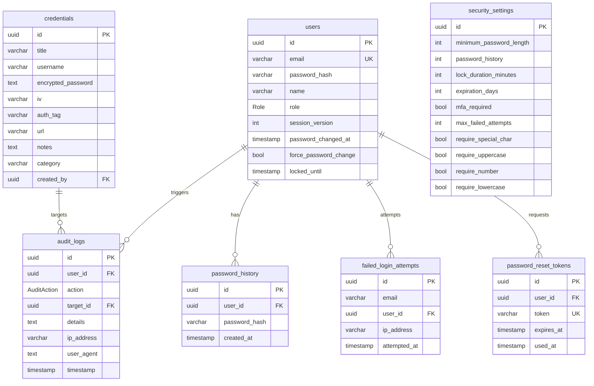

# SecureVault

A self-hosted credential administration system with envelope-free AES-256-GCM
encryption at rest, append-only audit logging, role-based access control, and a
configurable password policy.

Built with **Next.js 16** (App Router), **React 19**, **TypeScript**, **Prisma 7**,
and **PostgreSQL 16**. Ships with full Arabic (RTL) and English localization.

---

## Features

- **AES-256-GCM encryption at rest** — unique 12-byte IV per secret, 16-byte auth
  tag for integrity verification. The master key never touches the database.
- **Append-only audit trail** — every login, reveal, mutation, and export is
  recorded with actor, target, IP, and user agent. Enforced by database triggers.
- **Three-tier RBAC** — `SUPER_ADMIN` / `EDITOR` / `VIEWER`.
- **Configurable password policy** — minimum length, complexity classes, reuse
  history, expiry, and lockout thresholds, editable by an admin at runtime.
- **Progressive delay & lockout** — failed logins back off exponentially before
  locking the account.
- **Forced password change** — admins can require a change on next login while
  preserving the current session.
- **Password reset flow** — time-limited single-use tokens.
- **Vault export** — encrypted-credential backup download, admin only.
- **Bilingual UI** — English and Arabic with full RTL layout switching.
- **Security headers** — CSP, `X-Frame-Options: DENY`, `nosniff`, strict referrer
  and permissions policies, applied globally in `next.config.ts`.

---

## Tech stack

| Layer | Technology |
|---|---|
| Framework | Next.js 16.2.9 (App Router, Turbopack, React Compiler) |
| UI | React 19, Tailwind CSS 4, shadcn/ui, Lucide icons |
| Forms | React Hook Form + Zod 4 |
| i18n | next-intl (en / ar + RTL) |
| ORM | Prisma 7.8 (`@prisma/adapter-pg`) |
| Database | PostgreSQL 16 |
| Auth | Custom JWT (`jose`, HS256) + bcrypt (cost 12) |
| Cryptography | `node:crypto` AES-256-GCM |
| Lint / format | Biome 2.2 |
| Language | TypeScript 5 |
| Package manager | pnpm |

---

## Quickstart

**Prerequisites:** Node.js 20+, pnpm 10+, Docker with Compose v2.

```bash
# 1. Install dependencies (runs prisma generate)
pnpm install

# 2. Create your environment file
cp .env.example .env.local

# 3. Generate the two required secrets and paste them into .env.local
openssl rand -hex 32     # -> ENCRYPTION_KEY  (64 hex chars)
openssl rand -base64 32  # -> SESSION_SECRET

# 4. Start PostgreSQL on localhost:5433
docker compose up -d

# 5. Apply the schema, install audit triggers, and seed
pnpm db:push
pnpm db:seed

# 6. Start the dev server
pnpm dev
```

Open <http://localhost:3000>.

`pnpm db:seed` creates a demo team and **prints every seeded account's password
to stdout** — capture it during the run. Set `SEED_ADMIN_EMAIL`,
`SEED_ADMIN_PASSWORD`, and `SEED_ADMIN_NAME` in `.env.local` before seeding to
control the first super admin account instead.

> **Back up `ENCRYPTION_KEY` before you store anything real.** There is no
> key-rotation path; losing or changing it makes every encrypted credential
> permanently unrecoverable.

---

## Environment variables

| Variable | Required | Description |
|---|---|---|
| `DATABASE_URL` | yes | PostgreSQL connection string |
| `ENCRYPTION_KEY` | yes | 64 hex chars (32 bytes) — AES-256-GCM master key |
| `SESSION_SECRET` | yes | HS256 signing secret; rotating invalidates all sessions |
| `SEED_ADMIN_EMAIL` | no | Seed only — overrides the first admin's email |
| `SEED_ADMIN_PASSWORD` | no | Seed only — overrides the first admin's password |
| `SEED_ADMIN_NAME` | no | Seed only — overrides the first admin's display name |
| `DB_HOST` / `DB_PORT` / `DB_USER` / `DB_PASSWORD` / `DB_NAME` | no | Docker Compose service overrides, read from `.env` |

See [`.env.example`](.env.example) for a fully commented template.

---

## Scripts

| Command | Description |
|---|---|
| `pnpm dev` | Start the development server |
| `pnpm build` | Production build |
| `pnpm start` | Serve the production build |
| `pnpm lint` | Biome lint + format with auto-fix |
| `pnpm format` | Biome format only |
| `pnpm typecheck` | `tsc --noEmit` |
| `pnpm db:generate` | Generate the Prisma client |
| `pnpm db:push` | Push the schema and install audit triggers |
| `pnpm db:seed` | Seed demo data and security settings |
| `pnpm db:studio` | Open Prisma Studio |

---

## Security model

### Cryptography

| Data | Protection |
|---|---|
| Stored credentials | AES-256-GCM, per-record 12-byte IV + 16-byte auth tag |
| Admin passwords | bcrypt, cost factor 12 |
| Sessions | HS256 JWT in an `HttpOnly`, `SameSite=Lax` cookie (`Secure` in production) |

`ENCRYPTION_KEY` is supplied via the environment and is never persisted to the
database. Session tokens carry a `sessionVersion`; incrementing it invalidates
every previously issued session, which is what password changes trigger.

### Threat model

| Threat | Mitigation |
|---|---|
| Stolen database dump | Credentials are encrypted; the key lives in the environment |
| Tampered ciphertext | GCM auth tag is verified on every decrypt |
| Password spraying | Progressive delay, then account lockout, plus rate limiting |
| SQL injection | Prisma parameterized queries throughout |
| XSS session theft | `HttpOnly` cookies |
| CSRF | `SameSite=Lax` cookies |
| Password reuse | Last-N history compared via bcrypt |
| Stale credentials | Configurable expiry with a forced-change dialog |
| Clickjacking | CSP `frame-ancestors 'none'` + `X-Frame-Options: DENY` |

### Known limitations

This is a self-hosted, single-tenant system. Before using it in production,
read [SECURITY.md](SECURITY.md) — it documents the intended threat model, the
out-of-scope areas, and the operational caveats around key rotation, the
in-memory rate limiter, and MFA.

---

## Role-based access control

| Action | SUPER_ADMIN | EDITOR | VIEWER |
|---|:---:|:---:|:---:|
| View / reveal credentials | Yes | Yes | Yes |
| Create credentials | Yes | Yes | No |
| Edit credentials | Yes | Yes | No |
| Delete credentials | Yes | Yes | No |
| Manage users | Yes | No | No |
| Security dashboard | Yes | No | No |
| Edit security policy | Yes | No | No |
| Export vault | Yes | No | No |
| View audit logs | Yes | No | No |

---

## Data model

| Model | Purpose |
|---|---|
| `User` | Accounts with role, session version, lockout state |
| `Credential` | Encrypted secrets (`encryptedPassword`, `iv`, `authTag`) |
| `AuditLog` | Append-only trail of every security-relevant action |
| `SecuritySettings` | Singleton row holding the live password policy |
| `PasswordHistory` | Bcrypt hashes of each user's last N passwords |
| `FailedLoginAttempt` | Drives progressive delay and lockout |
| `PasswordResetToken` | Single-use, time-limited reset tokens |

<details>
<summary>ER diagram</summary>



</details>

---

## Project structure

```
secure-vault/
├── docker-compose.yml        # PostgreSQL 16 service
├── messages/                 # next-intl catalogs (en.json, ar.json)
├── prisma/
│   ├── schema.prisma         # 7 models, 2 enums
│   ├── seed.ts               # Demo team + security settings
│   └── setup-triggers.ts     # Audit-log immutability triggers
└── src/
    ├── proxy.ts              # JWT gate for protected routes
    ├── app/
    │   ├── actions/          # Server Actions (auth, users, credentials, …)
    │   ├── api/              # /api/credentials/{reveal,export}
    │   ├── dashboard/        # vault, users, audit, security, settings
    │   ├── login/  forgot-password/  reset-password/
    ├── components/           # credential/, dashboard/, common/, ui/
    ├── i18n/                 # Locale routing and message loading
    └── lib/                  # crypto, auth, session, policy, audit, rate-limit
```

---

## Contributing

Issues and pull requests are welcome. Please read
[CONTRIBUTING.md](CONTRIBUTING.md) for the branch and commit conventions, and
[CODE_OF_CONDUCT.md](CODE_OF_CONDUCT.md) before participating.

## Security

Do not open a public issue for a vulnerability. See
[SECURITY.md](SECURITY.md) for the disclosure process and supported versions.

## License

[MIT](LICENSE) © 2026 Najm Alzorqah
