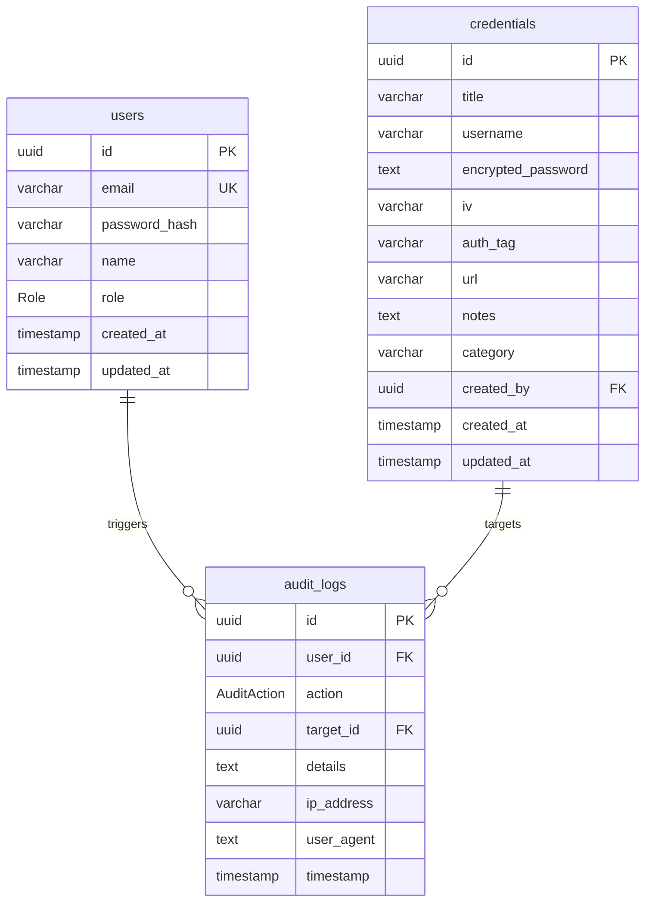

# SecureVault — Password Administration System

An enterprise-grade, high-security password administration system built with **Next.js 16 (App Router)**, **PostgreSQL 16**, **Prisma 7**, and **Tailwind CSS**. Developed to fulfill all architectural and cryptographic requirements of an advanced Information Security course.

---

## 🔒 Security Architecture & Cryptographic Integrity

### 1. Cryptographic Design (AES-256-GCM)
The system stores secrets using **Authenticated Symmetric Encryption** via the **AES-256-GCM** (Advanced Encryption Standard in Galois/Counter Mode) algorithm:
* **Confidentiality:** All credentials passwords are encrypted using a 256-bit server-managed master key (`ENCRYPTION_KEY`).
* **Integrity & Authenticity:** AES-GCM generates a 16-byte authentication tag (`authTag`). During decryption, the cipher validates the tag to ensure the ciphertext has not been tampered with or modified.
* **Semantics (Unique IV):** A unique, cryptographically secure random 12-byte Initialization Vector (`iv`) is generated for *every single* encryption call. This prevents identical plaintexts from yielding identical ciphertexts (pattern analysis).

### 2. Password Hashing (bcrypt)
Administrator passwords are never stored in plaintext. They are hashed using **bcrypt** with a work factor (cost) of **12**:
* **Salt Generation:** bcrypt automatically generates a random salt per user, preventing rainbow table attacks.
* **Slow Hashing:** Designed to be computation-intensive, resisting brute-force and hardware acceleration (GPU/ASIC) attacks.

### 3. Session Security
Sessions are managed statelessly using **JWT (JSON Web Tokens)** via the `jose` library:
* **HttpOnly Flag:** Session cookies are inaccessible to client-side scripts, completely mitigating Cross-Site Scripting (XSS) session theft.
* **Secure Flag:** Cookies are only sent over HTTPS connections (enforced in production).
* **SameSite=Lax:** Controls cookie transmission on cross-origin requests, mitigating Cross-Site Request Forgery (CSRF).
* **Cryptographic Signatures:** Every session JWT is signed using a server-side `SESSION_SECRET` via HS256 to prevent tampering.

### 4. Threat Model & Mitigations
* **Compromised Database:** If the database leaks, the credentials remain secure since decryption requires the master `ENCRYPTION_KEY` (stored in env files, not committed).
* **Timing timing attacks:** Password verification utilizes constant-time comparison algorithms to prevent side-channel timing analysis.
* **Brute-Force Login Protection:** In-memory rate limiting blocks IP addresses after **5 failed login attempts** in a 15-minute window.
* **SQL Injection:** Parameterized queries are enforced across the entire data layer via the Prisma ORM.

---

## 👥 Role-Based Access Control (RBAC)

The system enforces three privilege tiers:

| Privilege / Action | Super Admin | Editor | Viewer |
| :--- | :---: | :---: | :---: |
| View Credentials | ✅ | ✅ | ✅ |
| Reveal Password / Copy | ✅ | ✅ | ✅ |
| Create Credentials | ✅ | ✅ | ❌ |
| Edit Credentials | ✅ | ✅ | ❌ |
| Delete Credentials | ✅ | ✅ | ❌ |
| Manage Users (CRUD) | ✅ | ❌ | ❌ |
| Export Database Backup | ✅ | ❌ | ❌ |
| View Security Audit Logs | ✅ | ❌ | ❌ |

---

## 📋 Database Schema



---

## 🚀 Setup & Execution Guide

### Prerequisites
* **Docker** & **Docker Compose**
* **Node.js** (v18+) & **pnpm** (v10+)

### 1. Environment Configurations
Clone the `.env.example` template:
```bash
cp .env.example .env.local
```
Fill in the values. Generate secure 32-byte keys for variables:
* **ENCRYPTION_KEY:** `node -e "console.log(require('crypto').randomBytes(32).toString('hex'))"`
* **SESSION_SECRET:** `openssl rand -base64 32`

### 2. Run Database Container
Spin up the local PostgreSQL database instance:
```bash
docker compose up -d
```

### 3. Database Migration & Seed
Initialize tables and push schema to the database:
```bash
pnpm db:push
```
Seed the database with default admin credentials and sample secrets:
```bash
pnpm db:seed
```
*Seeded Super Admin Credentials:*
* **Email:** `admin@vault.local`
* **Password:** `Admin@2024!Secure`

### 4. Start Development Server
```bash
pnpm dev
```
Open [http://localhost:3000](http://localhost:3000) inside your web browser.
