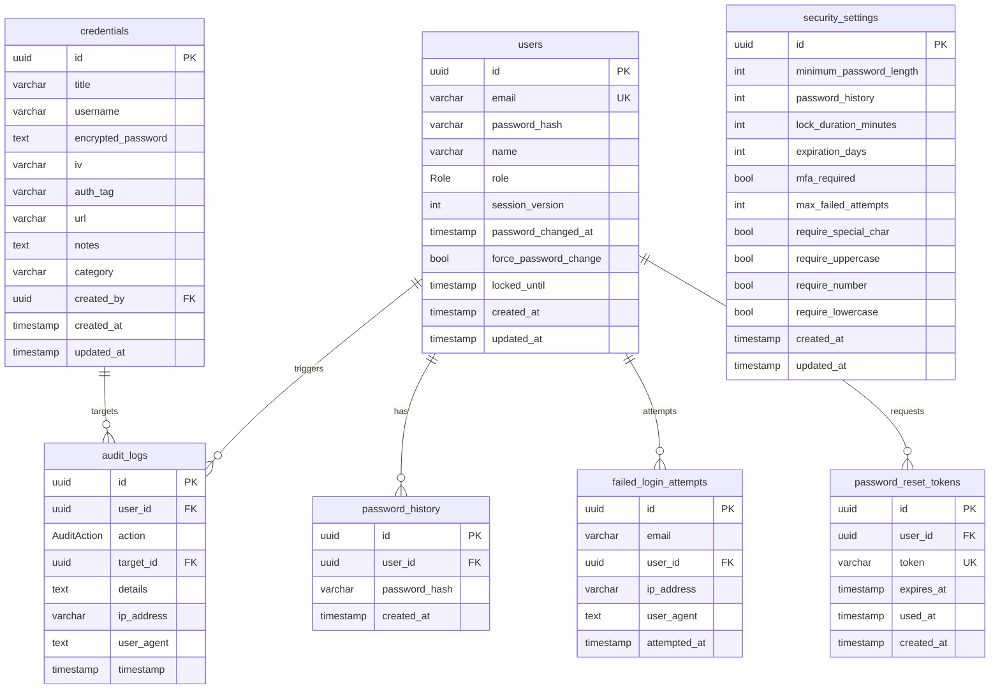

# SecureVault — Password Administration System

An enterprise-grade, high-security password administration system built with **Next.js 16 (App Router)**, **PostgreSQL 16**, **Prisma 7**, and **Tailwind CSS**. Developed to fulfill all architectural and cryptographic requirements of an advanced Information Security course.

---

## Table of Contents

- [Architecture Overview](#architecture-overview)
- [Tech Stack](#tech-stack)
- [Project Structure](#project-structure)
- [Database Schema](#database-schema)
- [Security Architecture](#security-architecture)
- [Role-Based Access Control](#role-based-access-control)
- [Advanced Security Features](#advanced-security-features)
- [API & Server Actions](#api--server-actions)
- [Setup & Execution Guide](#setup--execution-guide)
- [Available Scripts](#available-scripts)
- [Environment Variables](#environment-variables)

---

## Architecture Overview

```
┌─────────────────────────────────────────────────────────────────┐
│                        Client (React 19)                        │
│   Dashboard Pages · Forms · Password Rules · Security Score     │
├─────────────────────────────────────────────────────────────────┤
│                     Server Actions (Next.js)                     │
│   auth · users · credentials · security-settings · pwd-reset    │
├─────────────────────────────────────────────────────────────────┤
│                         Middleware (proxy.ts)                    │
│   JWT Verification · RBAC Routing · Public Route Guards         │
├─────────────────────────────────────────────────────────────────┤
│                      Prisma 7 ORM (Type-Safe)                   │
│   Parameterized Queries · AES-256-GCM · bcrypt · JWT (jose)    │
├─────────────────────────────────────────────────────────────────┤
│                      PostgreSQL 16                              │
│   Users · Credentials · AuditLogs · SecuritySettings            │
│   PasswordHistory · FailedLoginAttempts · PasswordResetTokens   │
└─────────────────────────────────────────────────────────────────┘
```

---

## Tech Stack

| Layer | Technology |
|---|---|
| Framework | Next.js 16.2.9 (App Router, Turbopack) |
| UI | React 19, Tailwind CSS 4, Shadcn/UI (base-nova), Lucide Icons |
| Forms | React Hook Form + Zod 4 (client validation) |
| ORM | Prisma 7.8.0 (`@prisma/adapter-pg`) |
| Database | PostgreSQL 16 |
| Auth | Custom JWT (`jose`) + bcrypt |
| Linter | Biome 2.2 |
| Language | TypeScript 5 |
| Package Manager | pnpm |
| Cryptography | AES-256-GCM (credentials), bcrypt cost 12 (passwords) |

---

## Project Structure

```
administration-system-for-managing-passwords/
├── prisma/
│   ├── schema.prisma          # Database schema (7 models, 2 enums)
│   ├── seed.ts                # Seeds admin user + SecuritySettings
│   ├── setup-triggers.ts      # Database triggers for audit immutability
│   └── config.ts              # Prisma 7 configuration
├── src/
│   ├── app/
│   │   ├── actions/           # Server Actions
│   │   │   ├── auth.ts        # Login, logout
│   │   │   ├── users.ts       # CRUD users, change password, force change
│   │   │   ├── credentials.ts # CRUD credentials, reveal password
│   │   │   ├── security-settings.ts  # Admin policy settings
│   │   │   └── password-reset.ts     # Request + reset password
│   │   ├── api/
│   │   │   └── credentials/
│   │   │       └── reveal/    # Decryption API endpoint
│   │   ├── dashboard/
│   │   │   ├── layout.tsx     # Auth guard + force password change dialog
│   │   │   ├── page.tsx       # Dashboard overview (stats + audit feed)
│   │   │   ├── audit/         # Audit log viewer
│   │   │   ├── security/      # Security dashboard + settings (SUPER_ADMIN)
│   │   │   ├── settings/      # User settings (password change + age display)
│   │   │   ├── users/         # User management (SUPER_ADMIN)
│   │   │   └── vault/         # Credential vault (CRUD)
│   │   ├── forgot-password/   # Forgot password page
│   │   ├── reset-password/    # Reset password page (token-based)
│   │   ├── login/             # Login page
│   │   ├── layout.tsx         # Root layout (fonts, metadata)
│   │   └── page.tsx           # Root redirect → /login
│   ├── components/
│   │   ├── credential/        # CredentialForm, VaultClient, RevealPassword, etc.
│   │   ├── dashboard/         # Sidebar, TopBar, UserForm, SettingsClient, etc.
│   │   │   ├── ForcePasswordChangeDialog.tsx  # Mandatory password change modal
│   │   │   ├── SecurityDashboardClient.tsx    # Security overview with score
│   │   │   ├── SecuritySettingsClient.tsx     # Admin policy config form
│   │   │   └── SettingsClient.tsx             # User settings + password age
│   │   └── ui/                # Shadcn components (Button, Card, Dialog, etc.)
│   ├── lib/
│   │   ├── auth.ts            # Password hashing, session verification, RBAC
│   │   ├── session.ts         # JWT creation/verification/deletion
│   │   ├── db.ts              # Prisma client singleton
│   │   ├── crypto.ts          # AES-256-GCM encrypt/decrypt
│   │   ├── audit.ts           # Audit log helper
│   │   ├── validations.ts     # Zod schemas (dynamic + static)
│   │   ├── security-settings.ts    # SecuritySettings fetch + cache
│   │   ├── password-policy.ts      # Password validation engine
│   │   ├── password-history.ts     # History check + record + prune
│   │   ├── password-expiry.ts      # Expiration check + age info
│   │   ├── password-reset.ts       # Token generation + validation
│   │   ├── progressive-delay.ts    # DB-backed login delay + lockout
│   │   ├── rate-limit.ts           # In-memory rate limiting
│   │   └── utils.ts                # cn() utility
│   └── generated/prisma/      # Generated Prisma client
├── docker-compose.yml         # PostgreSQL 16 container
├── next.config.ts
├── biome.json
├── tsconfig.json
└── package.json
```

---

## Database Schema

### Models

| Model | Purpose |
|---|---|
| `User` | Admin accounts with roles, session versioning, lockout fields |
| `Credential` | AES-256-GCM encrypted secrets (password, IV, authTag) |
| `AuditLog` | Append-only audit trail (all user actions) |
| `SecuritySettings` | Singleton row — global password policy config |
| `PasswordHistory` | Bcrypt hashes of previous N passwords per user |
| `FailedLoginAttempt` | DB-backed failed login tracking for progressive delay |
| `PasswordResetToken` | Time-limited tokens for password reset flow |

### Enums

| Enum | Values |
|---|---|
| `Role` | `SUPER_ADMIN`, `EDITOR`, `VIEWER` |
| `AuditAction` | `LOGIN`, `LOGOUT`, `LOGIN_FAILED`, `VIEW_PASSWORD`, `CREATE_CREDENTIAL`, `UPDATE_CREDENTIAL`, `DELETE_CREDENTIAL`, `CREATE_USER`, `UPDATE_USER`, `DELETE_USER`, `CHANGE_PASSWORD`, `EXPORT_CREDENTIALS`, `PASSWORD_RESET_REQUEST`, `PASSWORD_RESET_COMPLETE` |

### ER Diagram



---

## Security Architecture

### 1. Cryptographic Design (AES-256-GCM)

All credential passwords are encrypted using **AES-256-GCM** (Authenticated Symmetric Encryption):

- **Confidentiality:** 256-bit server-managed master key (`ENCRYPTION_KEY`)
- **Integrity & Authenticity:** 16-byte authentication tag (`authTag`) validates ciphertext integrity
- **Unique IV:** Every encryption generates a fresh 12-byte random IV, preventing pattern analysis

### 2. Password Hashing (bcrypt)

Admin passwords are hashed using **bcrypt** with cost factor **12**:

- Automatic random salt per user (rainbow table resistant)
- Deliberately slow (brute-force resistant)
- Constant-time comparison (timing attack resistant)

### 3. Session Security (JWT)

Stateless sessions via `jose` library:

- **HttpOnly:** inaccessible to client-side scripts (XSS mitigation)
- **Secure:** HTTPS-only in production
- **SameSite=Lax:** CSRF mitigation
- **HS256 signed:** prevents token tampering
- **Session versioning:** password changes invalidate all existing sessions

### 4. Threat Model & Mitigations

| Threat | Mitigation |
|---|---|
| Compromised database | Credentials encrypted; master key in env, not in DB |
| Timing attacks | Constant-time bcrypt comparison |
| Brute-force login | Progressive delay + account lockout |
| SQL injection | Prisma ORM parameterized queries |
| XSS session theft | HttpOnly JWT cookies |
| CSRF | SameSite=Lax cookies |
| Password reuse | History tracking (bcrypt compare against last N hashes) |
| Expired passwords | Configurable expiration + forced change dialog |

---

## Role-Based Access Control

| Action | SUPER_ADMIN | EDITOR | VIEWER |
|---|:---:|:---:|:---:|
| View Credentials | Yes | Yes | Yes |
| Reveal Password / Copy | Yes | Yes | Yes |
| Create Credentials | Yes | Yes | No |
| Edit Credentials | Yes | Yes | No |
| Delete Credentials | Yes | Yes | No |
| Manage Users (CRUD) | Yes | No | No |
| Security Dashboard | Yes | No | No |
| Security Policy Settings | Yes | No | No |
| Export Database Backup | Yes | No | No |
| View Security Audit Logs | Yes | No | No |

---

## Advanced Security Features

### 1. Configurable Password Policy (`SecuritySettings`)

Admins (SUPER_ADMIN) can configure the following via the Security Settings page (`/dashboard/security/settings`):

| Setting | Default | Description |
|---|---|---|
| `minimumPasswordLength` | 12 | Minimum characters required |
| `requireUppercase` | true | Require A-Z |
| `requireLowercase` | true | Require a-z |
| `requireNumber` | true | Require 0-9 |
| `requireSpecialChar` | true | Require non-alphanumeric |
| `passwordHistory` | 5 | Remember last N passwords |
| `maxFailedAttempts` | 5 | Lock after N failures |
| `lockDuration` | 15 | Lockout duration (minutes) |
| `expirationDays` | 90 | Password expiry (0 = never) |

### 2. Password History

- On every password change, the new bcrypt hash is recorded in `PasswordHistory`
- Before allowing a change, the system compares the new password against the last N hashes using `bcrypt.compare`
- Old records beyond the history limit are pruned automatically

### 3. Failed Login Tracking + Progressive Delay

- All failed logins are recorded in `FailedLoginAttempt` (email, userId, IP, timestamp)
- Progressive delay tiers:
  - Attempts 1-4: **0s** delay
  - Attempts 5-9: **5s** delay
  - Attempts 10-14: **30s** delay
  - Attempts 15+: **5 minutes** delay
- After `maxFailedAttempts`, the account is locked for `lockDuration` minutes
- Successful login clears all failed attempts

### 4. Password Expiration

- Configurable via `expirationDays` (0 = never expires)
- On dashboard layout render, checks if password age exceeds the policy
- If expired, sets `forcePasswordChange = true` on the user

### 5. Forced Password Change Dialog

- When `forcePasswordChange` is true (admin-set or expiry-triggered), a full-screen modal overlay blocks all interaction
- No close button, no escape key — completely inescapable
- Requires: current password, new password, confirm password
- Dynamic validation rules from SecuritySettings
- On success, `forcePasswordChange` is cleared and the dialog disappears

### 6. Password Reset Tokens

- **Request flow:** User visits `/forgot-password`, enters email → generates a crypto-random token stored as bcrypt hash in `PasswordResetToken` (1-hour expiry)
- **Reset flow:** User clicks link → `/reset-password?token=...` → enters new password → token validated → password updated → token marked as used
- Always returns generic message to prevent email enumeration

### 7. Security Dashboard (`/dashboard/security`)

- **Security Score** calculator based on policy strength (0-100)
- Stats: total users, locked users, failed attempts (24h), expired passwords
- Recent security events feed (LOGIN_FAILED, PASSWORD_RESET_REQUEST, PASSWORD_RESET_COMPLETE)
- Current Security Policy display with "Configure" link to settings

### 8. Password Age Display

- Settings page shows a progress bar of password age
- Color-coded: green (fresh) → yellow (aging) → red (expired)
- Countdown to expiration
- Force change banner when applicable

---

## API & Server Actions

### Server Actions

| Action | File | Description |
|---|---|---|
| `login()` | `actions/auth.ts` | Authenticate with progressive delay |
| `logout()` | `actions/auth.ts` | Destroy session + audit log |
| `createUser()` | `actions/users.ts` | Create user with dynamic password policy |
| `updateUser()` | `actions/users.ts` | Update user, optional password change |
| `deleteUser()` | `actions/users.ts` | Delete user + cascade |
| `changePassword()` | `actions/users.ts` | Voluntary password change (deletes session) |
| `forceChangePassword()` | `actions/users.ts` | Mandatory password change (keeps session) |
| `createCredential()` | `actions/credentials.ts` | Create + AES-256-GCM encrypt |
| `updateCredential()` | `actions/credentials.ts` | Update + re-encrypt |
| `deleteCredential()` | `actions/credentials.ts` | Delete credential |
| `updateSecuritySettings()` | `actions/security-settings.ts` | Admin policy config |
| `requestPasswordReset()` | `actions/password-reset.ts` | Generate reset token |
| `resetPassword()` | `actions/password-reset.ts` | Reset password with token |

### API Routes

| Endpoint | Method | Auth | Description |
|---|---|---|---|
| `/api/credentials/reveal` | POST | SESSION + rate limit | Decrypt + return plaintext (10s timeout) |

---

## Setup & Execution Guide

### Prerequisites

- **Docker** & **Docker Compose**
- **Node.js** (v18+) & **pnpm** (v10+)

### 1. Environment Setup

```bash
cp .env.example .env.local
```

Generate secure keys:

```bash
# ENCRYPTION_KEY (64 hex chars = 32 bytes)
node -e "console.log(require('crypto').randomBytes(32).toString('hex'))"

# SESSION_SECRET (base64)
openssl rand -base64 32
```

### 2. Start Database

```bash
docker compose up -d
```

### 3. Initialize Database

```bash
pnpm db:push     # Push schema + setup triggers
pnpm db:seed     # Seed admin user + security settings
```

**Default Admin Credentials:**
- Email: `admin@vault.local`
- Password: `Admin@2024!Secure`

### 4. Start Development Server

```bash
pnpm dev
```

Open [http://localhost:3000](http://localhost:3000).

---

## Available Scripts

| Command | Description |
|---|---|
| `pnpm dev` | Start development server (Turbopack) |
| `pnpm build` | Production build |
| `pnpm start` | Start production server |
| `pnpm lint` | Run Biome linter with auto-fix |
| `pnpm format` | Run Biome formatter |
| `pnpm db:generate` | Generate Prisma client |
| `pnpm db:push` | Push schema to database + setup triggers |
| `pnpm db:seed` | Seed database with defaults |
| `pnpm db:studio` | Open Prisma Studio |

---

## Environment Variables

| Variable | Required | Description |
|---|---|---|
| `DATABASE_URL` | Yes | PostgreSQL connection string |
| `ENCRYPTION_KEY` | Yes | 32-byte hex key for AES-256-GCM |
| `SESSION_SECRET` | Yes | Base64 secret for JWT signing |
| `SEED_ADMIN_EMAIL` | No | Default admin email (seed only) |
| `SEED_ADMIN_PASSWORD` | No | Default admin password (seed only) |
| `SEED_ADMIN_NAME` | No | Default admin name (seed only) |
