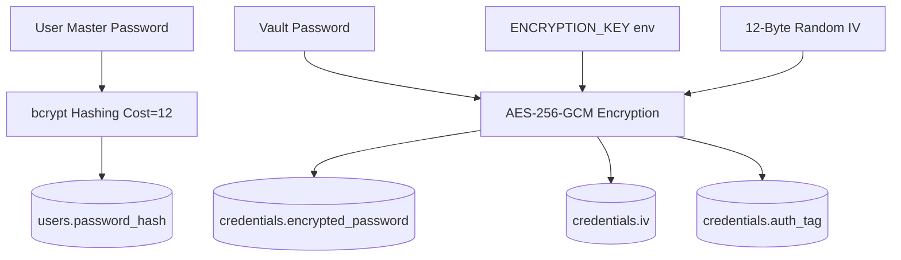
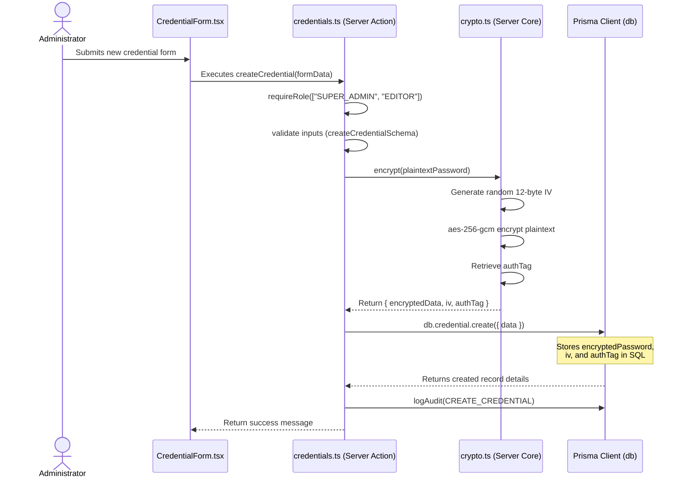
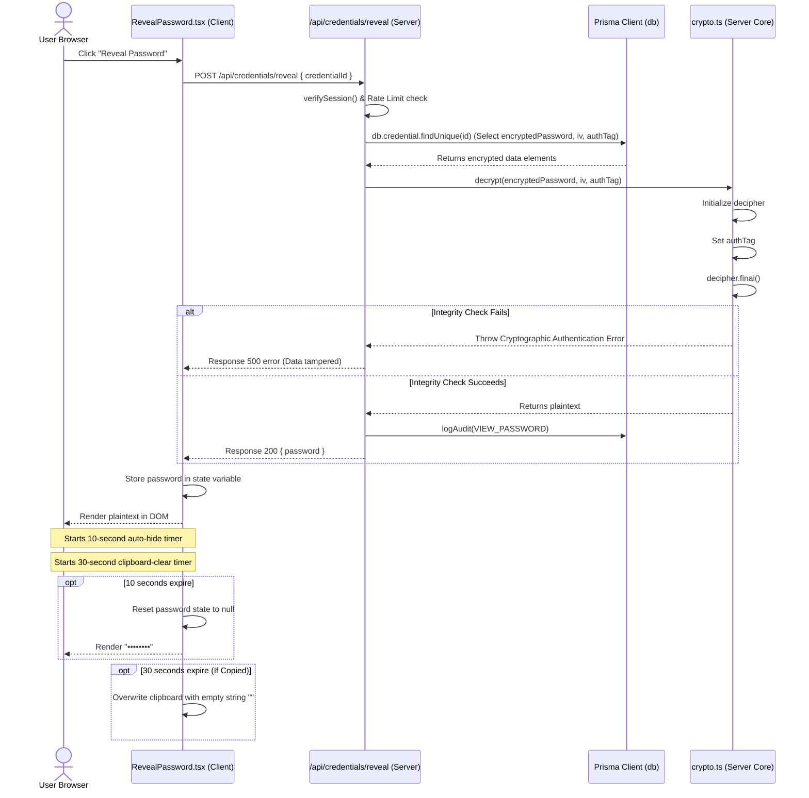

# SecureVault — Developer Cryptography & Security Guide

This document provides a deep-dive developer reference detailing the mathematical, architectural, and code-level cryptographic implementations inside the **SecureVault** system. It explains how password hashing, symmetric encryption, and session signing function to ensure confidentiality, integrity, and non-repudiation.

---

## 🔒 1. Core Cryptographic Paradigm

SecureVault employs a dual-cryptography strategy designed to address two distinct security goals:

1. **Irreversible Hashing (bcrypt):** Used for user authentication credentials. We must *never* be able to decrypt a user's master password. Instead, we compute a slow, salted hash and compare it in constant time.
2. **Reversible Authenticated Encryption (AES-256-GCM):** Used for vault credentials (username, passwords, notes, URLs). Since the user must retrieve their plaintext passwords, we encrypt them with a strong symmetric key (`ENCRYPTION_KEY`) on the server. Decryption is performed on demand, only under active session authorization.



---

## 🔑 2. Symmetric Encryption (AES-256-GCM)

SecureVault encrypts password values using **AES-256-GCM** (Advanced Encryption Standard in Galois/Counter Mode).

### A. Why Galois/Counter Mode (GCM)?
Traditional encryption modes (like CBC - Cipher Block Chaining) only provide **confidentiality**. They do not guarantee **integrity** or **authenticity**. An attacker who can modify the database could manipulate ciphertext blocks (bit-flipping attacks) to alter decrypted data without the server knowing.

GCM is an **Authenticated Encryption with Associated Data (AEAD)** mode. It produces two outputs:
1. **Ciphertext:** The encrypted text.
2. **Authentication Tag (Auth Tag):** A 16-byte cryptographically secure checksum generated using a universal hash function over the ciphertext and initialization vector.

During decryption, the algorithm computes the authentication tag and compares it to the stored `authTag`. If a single bit in the ciphertext, IV, or tag is altered, decryption fails, preventing tampered data from being processed.

### B. Parameters & Inputs
* **Master Key:** 256 bits (32 bytes), hex-encoded (64 characters) in `process.env.ENCRYPTION_KEY`.
* **Initialization Vector (IV):** A 12-byte (96-bit) value. Under GCM standards, 12 bytes is the optimal IV size.
* **Authentication Tag:** A 16-byte (128-bit) tag.

> [!CAUTION]
> **IV Reuse Vulnerability:** In GCM, you MUST NEVER reuse the same IV with the same key. Reusing an IV (called a "nonce reuse attack") allows an attacker to reconstruct the XOR of the two plaintexts, completely breaking the confidentiality of the cipher. 
> SecureVault generates a cryptographically secure random IV for *every single* encryption transaction using `crypto.randomBytes(12)`.

### C. Implementation Walkthrough
The implementation resides in [src/lib/crypto.ts](file:///home/najm/code/administration-system-for-managing-passwords/src/lib/crypto.ts).

#### 1. Encryption Flow
When a secret is stored or updated, `encrypt(plaintext)` is executed:
```typescript
export function encrypt(plaintext: string): {
  encryptedData: string;
  iv: string;
  authTag: string;
} {
  const key = getEncryptionKey(); // Retrieves 32-byte buffer from env
  const iv = crypto.randomBytes(12); // Generates cryptographically secure 12-byte IV
  const cipher = crypto.createCipheriv("aes-256-gcm", key, iv);

  let encrypted = cipher.update(plaintext, "utf8", "hex");
  encrypted += cipher.final("hex");

  // Retrieve the 16-byte integrity tag
  const authTag = cipher.getAuthTag().toString("hex");

  return {
    encryptedData: encrypted,
    iv: iv.toString("hex"),
    authTag,
  };
}
```

#### 2. Decryption Flow
When a user reveals a credential, the database fields are pulled and passed to `decrypt(...)`:
```typescript
export function decrypt(
  encryptedData: string,
  ivHex: string,
  authTagHex: string,
): string {
  const key = getEncryptionKey();
  const iv = Buffer.from(ivHex, "hex");
  const authTag = Buffer.from(authTagHex, "hex");

  const decipher = crypto.createDecipheriv("aes-256-gcm", key, iv);
  decipher.setAuthTag(authTag); // Set tag to verify payload authenticity

  let decrypted = decipher.update(encryptedData, "hex", "utf8");
  decrypted += decipher.final("utf8"); // Throws error if authTag verification fails

  return decrypted;
}
```

---

## 🧮 3. Password Hashing (bcrypt)

User administrative accounts are protected by **bcrypt**.

### A. The Strength of bcrypt
Unlike standard hash algorithms like SHA-256, MD5, or SHA-3 (which are designed to be extremely fast for file checksumming), bcrypt is **deliberately slow**. 
Modern GPU clusters can calculate billions of SHA-256 hashes per second, making them highly vulnerable to brute-force dictionary attacks if database records are leaked. 

Bcrypt solves this through:
1. **Adaptive Work Factor (Cost):** The number of hashing iterations is exponential ($2^{\text{cost}}$). SecureVault uses a cost factor of `12` ($2^{12} = 4096$ internal iterations), making each login check take roughly 100-250ms of CPU time. This is imperceptible to users but bricks high-speed GPU offline brute-force attempts.
2. **Built-in Salting:** Every time `bcrypt.hash()` is called, it generates a unique random 16-byte salt and embeds it in the resulting hash string. This makes rainbow table attacks (precomputed lists of passwords and hashes) mathematically impossible.

### B. Verification & Side-Channel Defense
A side-channel timing attack occurs when an attacker measures the exact CPU execution time of a comparison function to guess characters. For example, if a function compares strings character-by-character and returns early on the first mismatch, comparing a string that matches 5 characters will take slightly longer than one that matches 0.

Bcrypt mitigates this by executing comparisons in **constant-time**, ensuring that password check duration is identical regardless of how close a guessed password is to the correct hash.

### C. Implementation Walkthrough
The implementation is defined in [src/lib/auth.ts](file:///home/najm/code/administration-system-for-managing-passwords/src/lib/auth.ts).

```typescript
const BCRYPT_COST_FACTOR = 12;

// Hashes password
export async function hashPassword(password: string): Promise<string> {
  return bcrypt.hash(password, BCRYPT_COST_FACTOR);
}

// Verifies password using constant-time comparison
export async function verifyPassword(
  password: string,
  hash: string,
): Promise<boolean> {
  return bcrypt.compare(password, hash);
}
```

---

## 🎟️ 4. Session Security (jose & JWT)

Authentication sessions are maintained statelessly using signed **JSON Web Tokens (JWT)**.

### A. Session Lifecycle
1. **Creation:** Upon successful login, the server builds a payload containing the `userId`, user `role`, and database `sessionVersion`. 
2. **Signing:** The token is signed using the **HS256** algorithm (HMAC with SHA-256) with a server-managed key derived from `SESSION_SECRET`.
3. **Cookie Distribution:** The token is set inside an HTTP response header as a secure cookie.

### B. Signed Session Cookie Flags
```typescript
cookieStore.set("session", token, {
  httpOnly: true, // Crucial: Prevents JavaScript (XSS) from reading the cookie
  secure: process.env.NODE_ENV === "production", // Enforces transmission only over HTTPS
  sameSite: "lax", // Prevents cookie transmission on cross-origin requests (CSRF mitigation)
  expires: expiresAt, // Hard expiration set to 24 hours
  path: "/", // Valid across all subdirectories
});
```

### C. Security Sync & Revocation Checks
The core vulnerability of stateless JWT sessions is the difficulty of **instant revocation**. If a session token is stolen, it remains valid until its natural expiration. 

To solve this, SecureVault implements a hybrid verification method in [src/lib/session.ts](file:///home/najm/code/administration-system-for-managing-passwords/src/lib/session.ts):
1. The user database record includes a `sessionVersion` integer (defaulting to `0`).
2. When the JWT is generated, the current `sessionVersion` is baked into the payload.
3. On every request, `getSession()` reads the cookie and queries PostgreSQL to verify the user exists and the database version matches:
   ```typescript
   const user = await db.user.findUnique({
     where: { id: userId },
     select: { sessionVersion: true },
   });
   if (!user || user.sessionVersion !== sessionVersion) {
     return null; // Deny session immediately
   }
   ```
4. When a user updates their password, the database updates the hash and **increments** `sessionVersion` by 1.
5. Instantly, all active sessions on other browsers/devices are invalidated because their JWT's payload version (e.g. `0`) no longer matches the database version (e.g. `1`).

---

## 💾 5. Database Schema & Mappings

The Prisma ORM interfaces directly with PostgreSQL. The database schema stores cryptographically critical elements in distinct columns:

```prisma
model Credential {
  id                String   @id @default(uuid()) @db.Uuid
  title             String   @db.VarChar(100)
  username          String   @db.VarChar(100)
  encryptedPassword String   @map("encrypted_password") @db.Text  // The AES Ciphertext
  iv                String   @db.VarChar(100)                    // The hex IV
  authTag           String   @map("auth_tag") @db.VarChar(100)   // The GCM Auth Tag
  url               String?  @db.VarChar(500)
  notes             String?  @db.Text
  category          String?  @db.VarChar(50)
  createdBy         String   @map("created_by") @db.Uuid
  createdAt         DateTime @default(now()) @map("created_at")
  updatedAt         DateTime @updatedAt @map("updated_at")
}
```

### Security Mappings:
* **`encryptedPassword`:** Maps to the hex-serialized output of GCM. Stored as `db.Text` to accommodate long credential strings.
* **`iv`:** Holds the hex-serialized initialization vector. Enforced as `VarChar(100)` to ensure space for standard GCM hex strings (typically 24 hex characters for 12 bytes).
* **`authTag`:** Holds the hex-serialized authentication tag. Enforced as `VarChar(100)` to hold the GCM authentication signature (typically 32 hex characters for 16 bytes).

---

## 🔄 6. Detailed Cryptographic Code Flow

### A. Storing an Encrypted Credential
The sequence below illustrates the code path when a password is saved using the `createCredential` server action:



### B. On-Demand Decryption & Cleansing
This diagram traces the exact variables and lifetimes when a password is decrypted for a user reveal request:



---

## 🔍 7. Cryptographic Testing & Verification Plan

Developers can verify the cryptographic system integrity using manual and automated tests.

### A. Testing Authentication (Bcrypt Cost & Salt Verification)
To verify that bcrypt is salting each password uniquely and applying correct cost workloads:
1. Register two different user profiles with the exact same password (e.g. `ComplexP@ss1`).
2. Query the PostgreSQL database directly:
   ```sql
   SELECT email, password_hash FROM users;
   ```
3. **Verification Criterion:** The `password_hash` entries must be completely different, despite having identical plaintexts. Each hash should start with `$2b$12$...` ($2b$ identifies the bcrypt version, $12$ verifies the cost factor).

### B. Testing AEAD Tamper Protection (Integrity Check)
To verify that AES-GCM acts as an authenticated encryption barrier:
1. Store a test credential via the admin dashboard.
2. Open Docker database console and modify a single character of the cipher text or tag in the database:
   ```sql
   UPDATE credentials SET encrypted_password = 'a' || SUBSTRING(encrypted_password, 2) WHERE title = 'Test Credential';
   ```
3. Attempt to click "Reveal" inside the SecureVault vault UI.
4. **Verification Criterion:** The reveal operation must fail. The API console must log an exception (`Unsupported state or key` or `Unsupported state`), and return a `500 Failed to decrypt credential` response, proving the GHASH authentication tag successfully intercepted database modifications.
