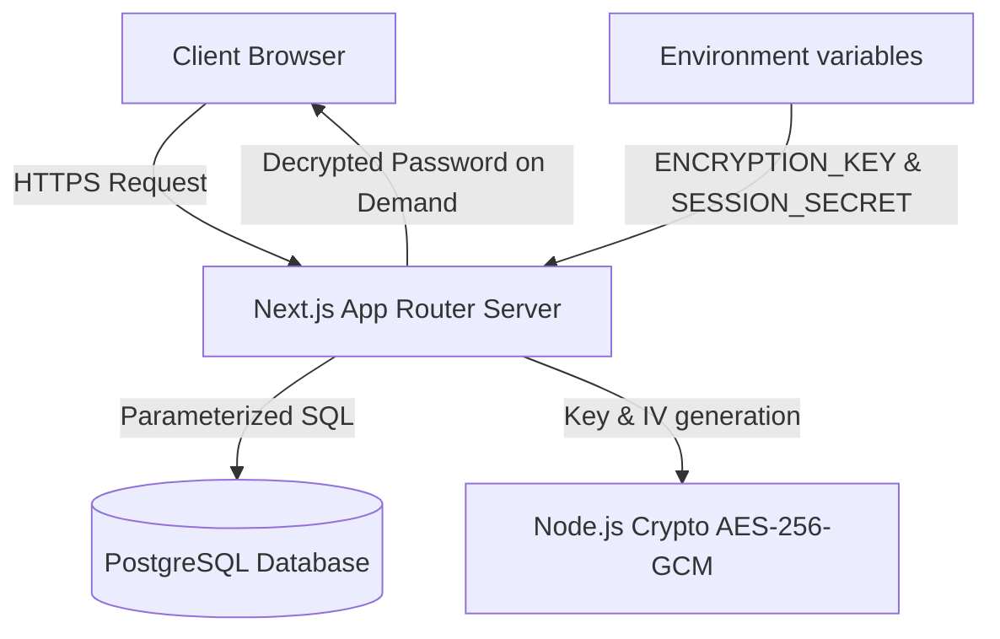
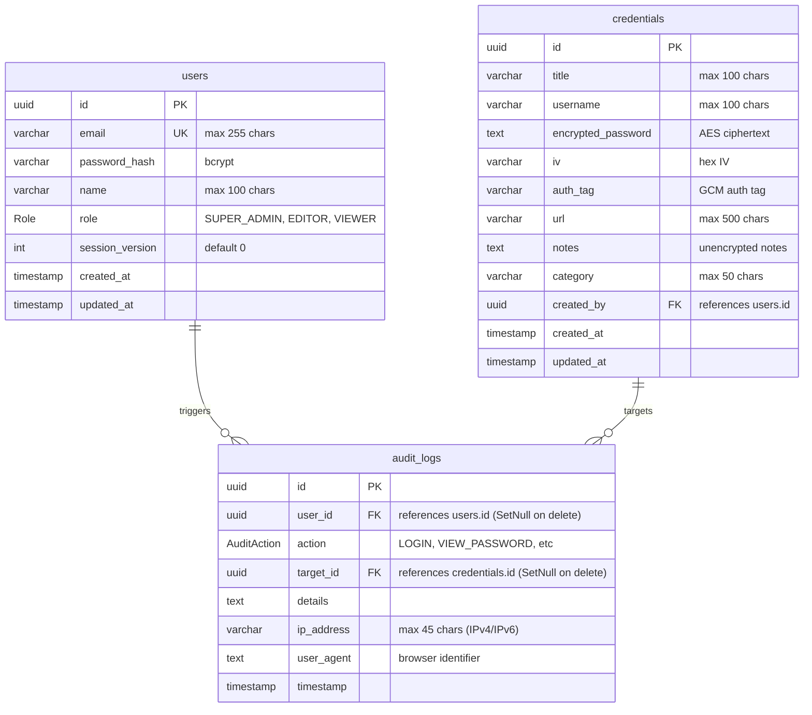
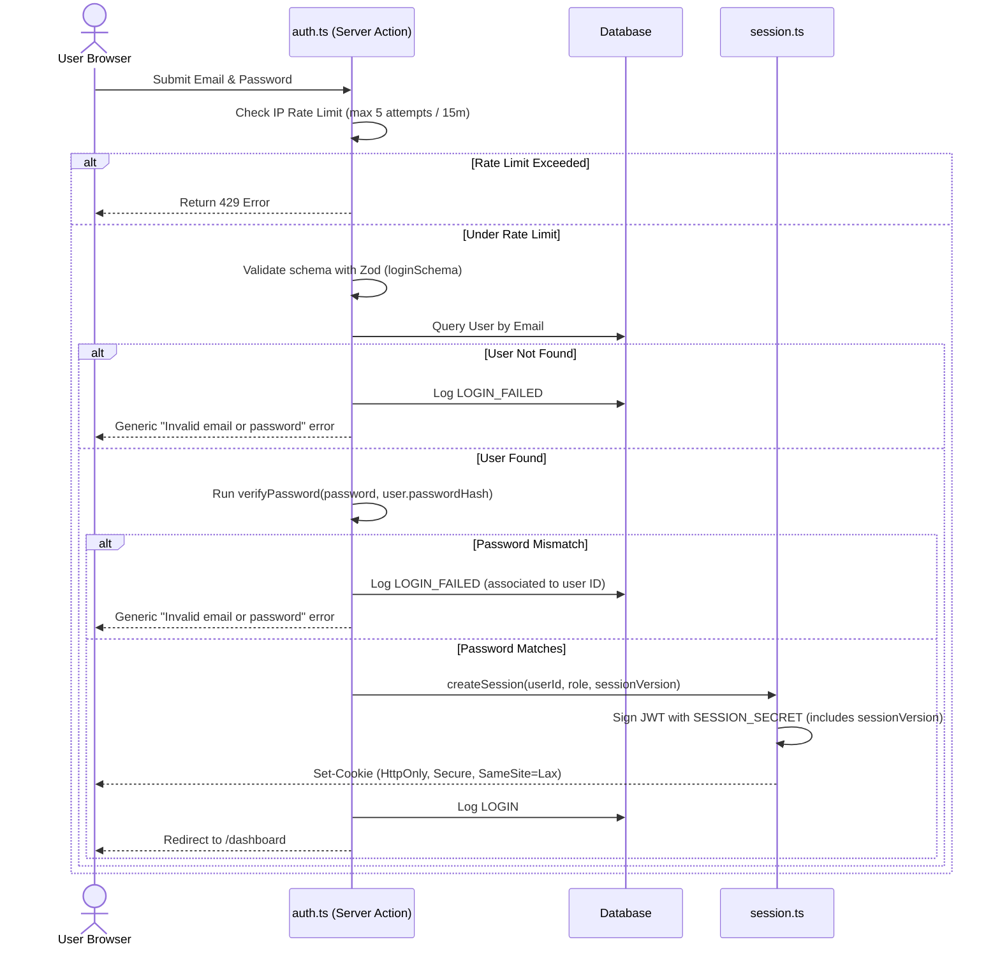
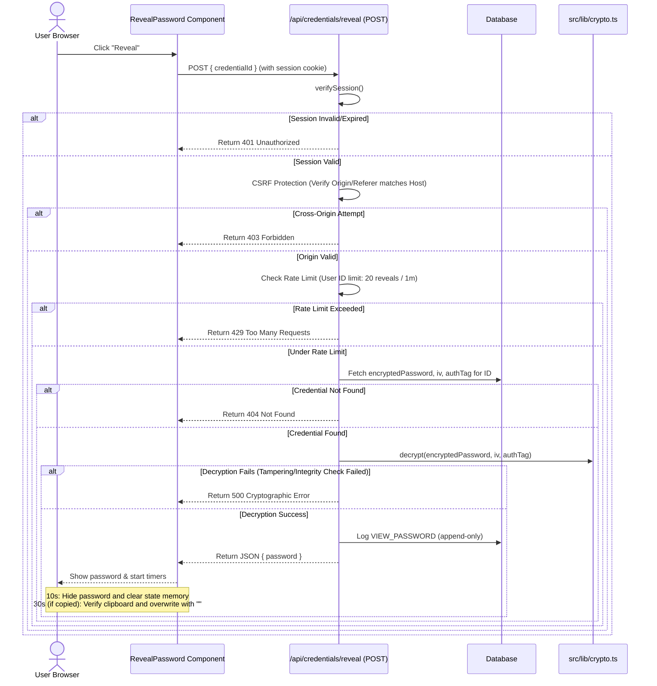

# SecureVault — Password Administration System: System Documentation Report

This report presents a comprehensive, detailed technical analysis and documentation of **SecureVault**, an enterprise-grade password administration system. It is designed to satisfy the rigorous security, architectural, and cryptographic standards of a modern Information Security environment.

---

## 📖 1. Introduction

In the current digital landscape, managing credentials securely is one of the most critical aspects of information security for any organization. **SecureVault** is an enterprise-grade, high-security password administration system built on a modern stack using **Next.js 16 (App Router)**, **React 19**, **PostgreSQL 16**, **Prisma 7**, and **Tailwind CSS**. 

The system provides a centralized platform for creating, reading, updating, and deleting sensitive operational credentials, while strictly enforcing:
1. **Authenticated Symmetric Cryptography** for data at rest.
2. **Stateless JWT-based session management** via secure, HTTP-only cookies.
3. **Role-Based Access Control (RBAC)** defining strict privilege levels.
4. **Database-Enforced Immutable Auditing** preventing updates, deletes, and unauthorized insertions via database triggers.
5. **Defensive security mitigations** including sliding window rate limiting, Content Security Policy (CSP) configurations, clipboard auto-clearing, and request source verification.

By keeping sensitive operations on the server side and enforcing modern web security standards, SecureVault minimizes the attack surface and ensures a tamper-evident audit trail for organizational compliance.

---

## 🎯 2. Problem Statement, Objective, and Scope

### A. Problem Statement
Many contemporary organizations suffer from poor credential management practices, such as writing passwords in physical media, sending credentials through unencrypted instant messengers, or reusing weak passwords across multiple accounts. 

Furthermore, existing password managers often pose distinct security and architectural challenges:
* **Cloud-based SaaS Solutions (e.g., LastPass, 1Password):** Create vendor lock-in, present single points of failure, and can expose the entire enterprise database in a cloud leak.
* **Client-side Decryption Managers (e.g., Bitwarden):** Distribute decryption keys to the client browser. Enforcing strict, centralized server-side access control (such as restricting password views dynamically or rate-limiting reveals per user) is difficult because the client has the full encrypted database blob.
* **Single-user Desktop Solutions (e.g., KeePassXC):** Lack centralized web management, concurrent multi-user permissions, real-time sync, and immutable security log trails.

From a web security standpoint, administrators need a solution that actively neutralizes common OWASP Top 10 vulnerabilities (such as SQL Injection, Cross-Site Scripting, and Cross-Site Request Forgery) while enforcing strict data confidentiality.

### B. Objective
The primary objective of SecureVault is to design, develop, and document a high-security, self-hosted password administration system that:
* **Symmetrically encrypts credentials** at rest using industry-standard authenticated encryption (`aes-256-gcm`).
* **Protects administrative interfaces** behind an authorization layer enforcing three privilege levels (`SUPER_ADMIN`, `EDITOR`, `VIEWER`).
* **Monitors system activity** via an append-only, tamper-evident security audit log.
* **Restricts cryptographic parameters** (ciphertexts, IVs, encryption keys) exclusively to the secure server runtime, sending plaintext values to authenticated clients only on demand, in memory, and with temporal expirations.
* **Neutralizes web threats** via strict input validation (Zod), rate limiting (IP and User-ID based), and defensive HTTP security headers.

### C. Scope
The scope of this implementation includes:
1. **Security Dashboard:** An administrative homepage presenting real-time system metrics (stored credentials, registered users, total audit logs) and a feed of the most recent security actions.
2. **Vault Management (Credentials CRUD):** Interfaces for managing credentials with categories/tags, URL mappings, and notes.
3. **User Account Management (CRUD):** Restricted exclusively to `SUPER_ADMIN` to manage user emails, names, passwords, and system roles.
4. **On-Demand Decryption API:** A secure `/api/credentials/reveal` endpoint that decrypts specific passwords only when requested by authenticated, rate-limited users.
5. **Tamper-Evident Security Log Trail:** A log table tracing transaction metrics, secured via database triggers so that records are read-only for outside connections (Prisma Studio, SQL consoles) and strictly append-only for the system application.
6. **Encrypted Backup Export:** An export utility allowing `SUPER_ADMIN` to download raw database copies containing encrypted ciphertexts, preserving the key separation architecture.
7. **Client-Side Security Components:** Password strength indicators (using `zxcvbn`), secure random password generators, 10-second reveal timeouts, and 30-second automatic clipboard clearing.

---

## 🔍 3. Related Works

To contextualize SecureVault's architecture, we compare it against alternative credentials management paradigms:

| Metric / Feature | **SecureVault (This Project)** | **Bitwarden / Vaultwarden** | **KeePassXC** | **HashiCorp Vault** |
| :--- | :--- | :--- | :--- | :--- |
| **Deployment Model** | Self-hosted Web Application | Self-hosted or Cloud SaaS | Desktop Application (Local) | Enterprise API/Infrastructure |
| **Decryption Locality** | **Server-side (On-demand API)** | Client-side (WebAssembly/JS) | Client-side (Desktop Memory) | Server-side (REST API) |
| **Authentication & RBAC** | Enforced by Server runtime | Enforced by Client policy | None (Master Password) | Highly granular Policies |
| **Tamper-evident Audit Logs** | **Built-in (Append-Only PostgreSQL)** | Basic event logs | None | Advanced logs (Syslog/File) |
| **Primary Audience** | Credentials Administrators | Individual Users & Teams | Technical power users | Developers & DevOps |

### Why SecureVault's Architecture is Unique:
In **Bitwarden**, the server acts as an encrypted storage vault. The client downloads the encrypted vault and decrypts it locally using a key derived from the user's master password. This "Zero-Knowledge" design protects the host server from viewing data, but makes it impossible for an organization's central security team to audit who is looking at what password in real time (as all decryption is client-side). 

**SecureVault** targets organizations that require **strict compliance and centralized auditing**. Because decryption occurs on the server in a controlled runtime, every single "Reveal" operation triggers a rate limit check, a privilege verify, and generates an immutable record in the PostgreSQL database showing who viewed the password, their IP, and browser signature.

---

## 🛠️ 4. Description of the Problem Solving

To solve the challenges of credential security and web vulnerabilities, SecureVault implements a series of architectural design patterns:



### A. Cryptographic Key Separation
To protect credentials from database leaks, the data is encrypted at rest using `aes-256-gcm`. The 256-bit symmetric `ENCRYPTION_KEY` is loaded as an environment variable in the secure server runtime. The database stores the ciphertext alongside the 12-byte initialization vector (`iv`) and 16-byte authenticity tag (`authTag`). If the PostgreSQL server is compromised, the data remains encrypted and unreadable without the master key.

### B. Defending against Session Stealing & CSRF
* **JWT Cookie Security:** Authentication tokens are stored in signed cookies utilizing the `HttpOnly` flag (blocking script access and mitigating XSS token harvesting) and `SameSite=Lax` (blocking cookie transmission on cross-origin requests and mitigating CSRF).
* **Cross-Device Session Revocation:** JWTs contain a `sessionVersion` payload. When a user updates their password, the user's database `sessionVersion` increments. On subsequent page loads, the session helper compares the JWT payload version with the database version. If they differ, the cookie is immediately invalidated. This terminates all active sessions across all devices.
* **Origin Header Verification:** Custom API endpoints verify the `Origin` or `Referer` against the `Host` header to ensure incoming requests originate directly from the host application.

### C. Restricting Plaintext Data Lifespan
When the user requests the dashboard or credentials lists, the database query uses Prisma select filters to explicitly **exclude** `encryptedPassword`, `iv`, and `authTag`. These fields are never serialized into standard page responses. They are queried and decrypted *only* during a discrete POST request to `/api/credentials/reveal`, after which the client-side state is purged after 10 seconds, and the clipboard is cleared 30 seconds after copying.

---

## 🔧 5. Tools Used in the Project

The application leverage a specialized selection of modern web technologies to maximize security and developer efficiency:

### A. Core Stack
* **Next.js 16.2.9 (App Router):** The core React framework, utilized for Server Actions (handling state updates securely without client APIs) and Server Components (rendering layouts without exposing sensitive database structures).
* **React 19.2.4 & React DOM 19.2.4:** Facilitates interactive client-side components (like copy timers, strength gauges) and leverages the new React Compiler for optimized render performance.
* **PostgreSQL 16 (Alpine Docker):** The relational database chosen for its transaction safety, support for UUID primary keys, and robust indexing on audit logs.

### B. Database Access & Security Libraries
* **Prisma ORM 7.8.0:** Acts as the database interface layer. It enforces type-safe queries, manages migrations, and automatically parameterizes all SQL queries to neutralize SQL injection vulnerabilities.
* **bcrypt 6.0.0 (Native Node package):** Handles slow, salted password hashing for users using a work factor of 12. It uses constant-time comparison algorithms to mitigate side-channel timing analysis.
* **jose 6.2.3:** A lightweight, dependency-free library for JWT signing (HS256) and decryption.
* **zod 4.4.3:** Enforces strict structural schemas for runtime input validation and sanitization.
* **zxcvbn 4.4.2:** A password strength estimation tool used to enforce strong credential requirements when users write or update passwords.

### C. Styling, UI, and Tooling
* **Tailwind CSS v4 & PostCSS v4:** Enables high-performance, responsive styling.
* **Base UI React v1.6.0 & Lucide React v1.22.0:** Accessible UI primitives and modern iconography.
* **Biome 2.2.0 (Linter & Formatter):** Enforces code style, checks for anti-patterns, and compiles code quality checks.
* **tsx v4.22.4:** Used to seed database records in TypeScript natively during initial provisioning.

---

## 📐 6. System Design

### A. Database Entity-Relationship Diagram (ERD)
The schema consists of three core tables mapping relational security associations:



### B. Role-Based Access Control (RBAC) Permissive Matrix
Access rights are strictly restricted using Role-Based Access Control. If a user attempts to call a Server Action or API that does not match their privilege level, the system triggers a validation failure on the server side:

| Capability / Resource | Super Admin | Editor | Viewer | Enforced in Code |
| :--- | :---: | :---: | :---: | :--- |
| **Read Credentials List** | ✅ | ✅ | ✅ | `verifySession()` in [src/lib/auth.ts](file:///home/najm/code/administration-system-for-managing-passwords/src/lib/auth.ts) |
| **Reveal Plaintext Password** | ✅ | ✅ | ✅ | Rate limit check & `/api/credentials/reveal` |
| **Create Credentials** | ✅ | ✅ | ❌ | `requireRole(["SUPER_ADMIN", "EDITOR"])` |
| **Edit Credentials** | ✅ | ✅ | ❌ | `requireRole(["SUPER_ADMIN", "EDITOR"])` |
| **Delete Credentials** | ✅ | ✅ | ❌ | `requireRole(["SUPER_ADMIN", "EDITOR"])` |
| **Manage Users (CRUD)** | ✅ | ❌ | ❌ | `requireRole(["SUPER_ADMIN"])` in [src/app/actions/users.ts](file:///home/najm/code/administration-system-for-managing-passwords/src/app/actions/users.ts) |
| **Export Database JSON Backup** | ✅ | ❌ | ❌ | `requireRole(["SUPER_ADMIN"])` in `/api/credentials/export` |
| **View System Audit Logs** | ✅ | ❌ | ❌ | `requireRole(["SUPER_ADMIN"])` in [src/app/dashboard/audit/page.tsx](file:///home/najm/code/administration-system-for-managing-passwords/src/app/dashboard/audit/page.tsx) |

### C. Detailed Transaction Flowcharts

#### 1. User Authentication Flow
This diagram details the flow when a user logs in, showcasing Zod parsing, bcrypt verify, rate limits, and JWT cookie setting.



#### 2. Password Reveal Lifecycle
This diagram details the sequence when a user clicks the "Reveal" button on a credential. It traces CSRF verification, User-ID rate limiting, database fetch of encryption fields, decryption, logging, and client timers.



---

## 💻 7. System Implementation

SecureVault translates these design parameters into distinct implementation modules. Below is a detailed look at the core code modules:

### A. Symmetric Encryption Engine
* **Path:** [src/lib/crypto.ts](file:///home/najm/code/administration-system-for-managing-passwords/src/lib/crypto.ts)
* **Encryption Logic:** Uses the Node.js native `crypto` module to initialize a cipher instance.
  ```typescript
  const iv = crypto.randomBytes(12);
  const cipher = crypto.createCipheriv("aes-256-gcm", key, iv);
  let encrypted = cipher.update(plaintext, "utf8", "hex");
  encrypted += cipher.final("hex");
  const authTag = cipher.getAuthTag().toString("hex");
  return { encryptedData: encrypted, iv: iv.toString("hex"), authTag };
  ```
* **Decryption & Integrity Check:** The decrypt function initializes a decipher, feeds the stored authentication tag back into GCM, and decrypts the ciphertext. If any byte of the ciphertext, IV, or tag was modified in PostgreSQL, `decipher.final()` throws a cryptographic authentication error, ensuring data tamper-evidence.
  ```typescript
  const decipher = crypto.createDecipheriv("aes-256-gcm", key, iv);
  decipher.setAuthTag(authTag);
  let decrypted = decipher.update(encryptedData, "hex", "utf8");
  decrypted += decipher.final("utf8");
  return decrypted;
  ```

### B. Input Validation & Sanitization Schema
* **Path:** [src/lib/validations.ts](file:///home/najm/code/administration-system-for-managing-passwords/src/lib/validations.ts)
* **Sanitization:** String inputs are automatically trimmed, emails are normalized to lowercase, and Zod schemas validate exact types.
* **Password Complexity Policy:** Standard complexity rules are applied when creating passwords or users using Zod regex rules:
  ```typescript
  password: z
    .string()
    .min(8, "Password must be at least 8 characters")
    .regex(/[a-zA-Z]/, "Password must contain at least one letter")
    .regex(/[0-9]/, "Password must contain at least one number")
    .regex(/[^a-zA-Z0-9]/, "Password must contain at least one special character")
  ```

### C. Rate Limiting System
* **Path:** [src/lib/rate-limit.ts](file:///home/najm/code/administration-system-for-managing-passwords/src/lib/rate-limit.ts)
* **Design:** Implements an in-memory sliding window using a `Map` key-value store. It filters and keeps timestamps within the preconfigured duration windows.
* **Memory Management:** To prevent memory leaks in the Node.js process, a 5-minute periodic interval (`setInterval`) cleans up expired rate-limit records.
* **Limit Configurations:**
  * **Login Rate Limit:** Max 5 attempts per 15 minutes, key mapped by IP address.
  * **Password Reveal Limit:** Max 20 reveals per 1 minute, key mapped by authenticated User ID.

### D. Session Lifecycle Security
* **Path:** [src/lib/session.ts](file:///home/najm/code/administration-system-for-managing-passwords/src/lib/session.ts)
* **JWT Cookie Storage:** Session cookies are set with the flags `httpOnly: true`, `sameSite: "lax"`, and `secure: process.env.NODE_ENV === "production"`.
* **Database Session Synchronization:** On every authenticated request, `getSession()` extracts the JWT payload, extracts the `userId` and `sessionVersion`, and queries the database:
  ```typescript
  const user = await db.user.findUnique({
    where: { id: userId },
    select: { sessionVersion: true },
  });
  if (!user || user.sessionVersion !== sessionVersion) {
    return null; // Session invalid (password was changed elsewhere)
  }
  ```

### E. Append-Only Security Audit Logging
* **Path:** [src/lib/audit.ts](file:///home/najm/code/administration-system-for-managing-passwords/src/lib/audit.ts)
* **Database-Level Immutability Triggers:** Implements absolute audit log protection directly at the database engine level (PostgreSQL) using custom DDL triggers, managed via [setup-triggers.ts](file:///home/najm/code/administration-system-for-managing-passwords/prisma/setup-triggers.ts).
  - **Modification Block:** A `BEFORE UPDATE OR DELETE` trigger (`trg_block_audit_log_modification`) unconditionally throws a database exception for any update or delete statement targeting the `audit_logs` table, preventing even superusers or the application itself from modifying existing logs.
  - **Insert Restriction:** A `BEFORE INSERT` trigger (`trg_block_audit_log_insert`) checks the PostgreSQL `application_name` of the current connection. It throws an exception unless `application_name` is exactly `'vault_app'`.
  - **Outside Access Restriction:** Any external tool, direct SQL command, or Prisma Studio session (running with default connection settings) cannot create or alter audit logs. They are restricted strictly to read-only (`SELECT`) access.
* **System Connection Configuration:**
  - Next.js database pool connections in [db.ts](file:///home/najm/code/administration-system-for-managing-passwords/src/lib/db.ts) and database seeding connections in [seed.ts](file:///home/najm/code/administration-system-for-managing-passwords/prisma/seed.ts) are programmatically configured to append `application_name=vault_app` to the connection string to satisfy the database-level validation check during legitimate logging.
* **Fault Tolerance:** If audit log writing fails, the error is piped to `console.error` (stderr), but the main operation proceeds. This ensures that database lockouts on the log table do not brick the authentication or reveal functions.

### F. Client Security Controls
* **Path:** [src/components/credential/RevealPassword.tsx](file:///home/najm/code/administration-system-for-managing-passwords/src/components/credential/RevealPassword.tsx)
* **Reveal Hide Timer:** The plaintext password is only saved to a local component state. A 10-second timeout resets this state to `null`:
  ```typescript
  setTimeout(() => {
    setVisible(false);
    setPassword(null);
  }, 10_000);
  ```
* **Clipboard Auto-Clear:** When the copy-to-clipboard action triggers, the component waits 30 seconds, reads the clipboard state, and overwrites it with an empty string *only if* the clipboard contents still match the copied secret:
  ```typescript
  setTimeout(async () => {
    try {
      const current = await navigator.clipboard.readText();
      if (current === password) {
        await navigator.clipboard.writeText("");
      }
    } catch {
      // Handle browser permission rejection gracefully
    }
  }, 30_000);
  ```

### G. Security Audit & Route Protection Middleware
* **Path:** [src/proxy.ts](file:///home/najm/code/administration-system-for-managing-passwords/src/proxy.ts)
* **Operation:** Validates JWT tokens using `jose` before requests reach protected layouts. Re-routes unauthenticated users trying to hit `/dashboard` to the `/login` route, and redirects logged-in users trying to hit `/login` back to the `/dashboard`.
* **Important Developer Notice:** In Next.js, custom middleware must be registered in a file named `middleware.ts` in the project root or the `src/` directory. Since this file is currently named `proxy.ts`, it is **not being executed by Next.js**. To operationalize this protection, the file should be renamed from `src/proxy.ts` to [src/middleware.ts](file:///home/najm/code/administration-system-for-managing-passwords/src/middleware.ts).

---

## 📋 8. Setup & Execution Summary

1. **Environment Initialization:**
   Copy the configuration template:
   ```bash
   cp .env.example .env.local
   ```
   Generate the master key and session secret:
   ```bash
   node -e "console.log(require('crypto').randomBytes(32).toString('hex'))"
   openssl rand -base64 32
   ```

2. **Spinning Up PostgreSQL Database:**
   Ensure Docker is running and trigger Compose:
   ```bash
   docker compose up -d
   ```

3. **Running Prisma Migrations & Seeding:**
   Push the schema state to PostgreSQL and create default users:
   ```bash
   pnpm db:push
   pnpm db:seed
   ```
   *Seeded Super Admin Account:*
   * **Email:** `najm@gmail.com`
   * **Password:** `Powernjm1*23`

   The seed is fully reset on each run and provisions 7 users (Arabic names), 30 credentials across 7 categories, password history, and a realistic audit trail.

4. **Starting Next.js Server:**
   ```bash
   pnpm dev
   ```
   The site will load on [http://localhost:3000](http://localhost:3000).

---
*Report compiled and verified against codebase implementation on June 30, 2026.*
