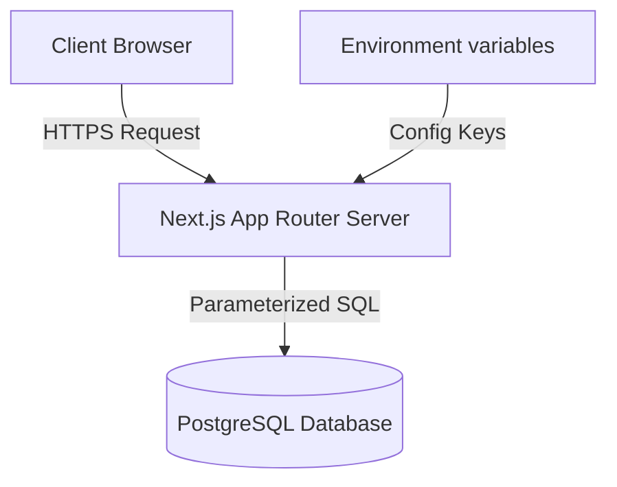
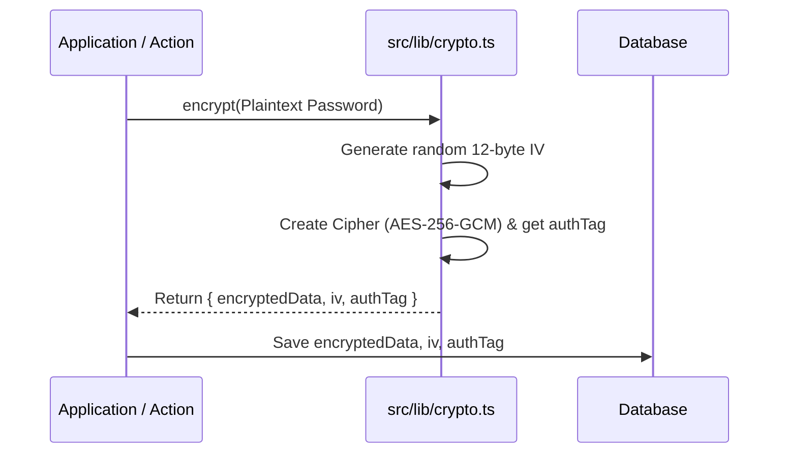
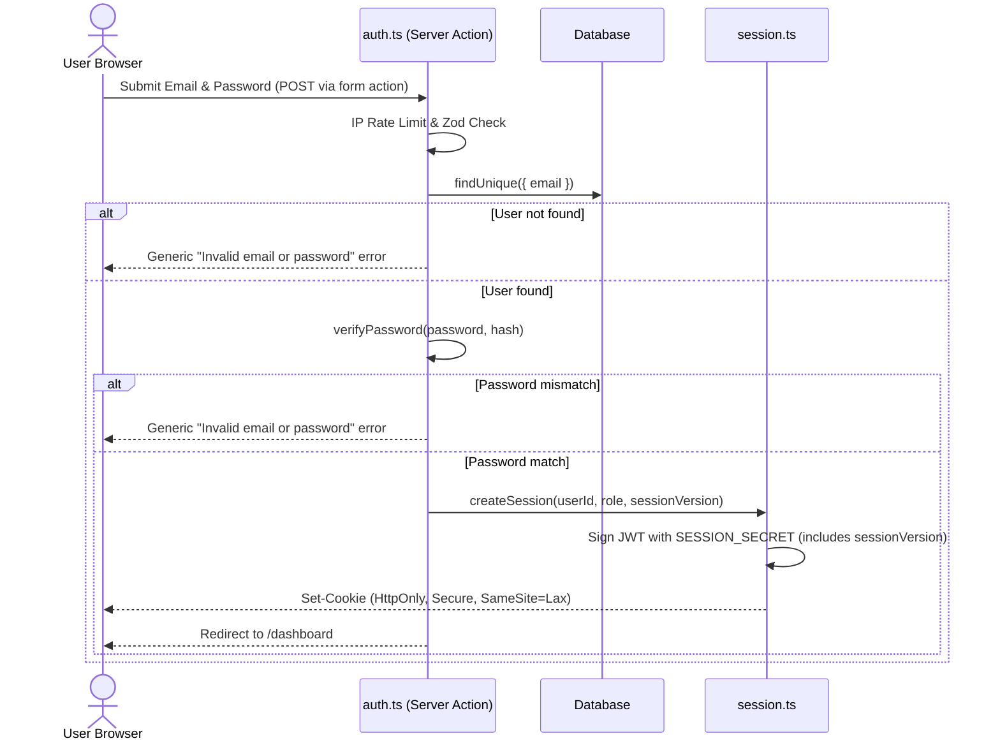
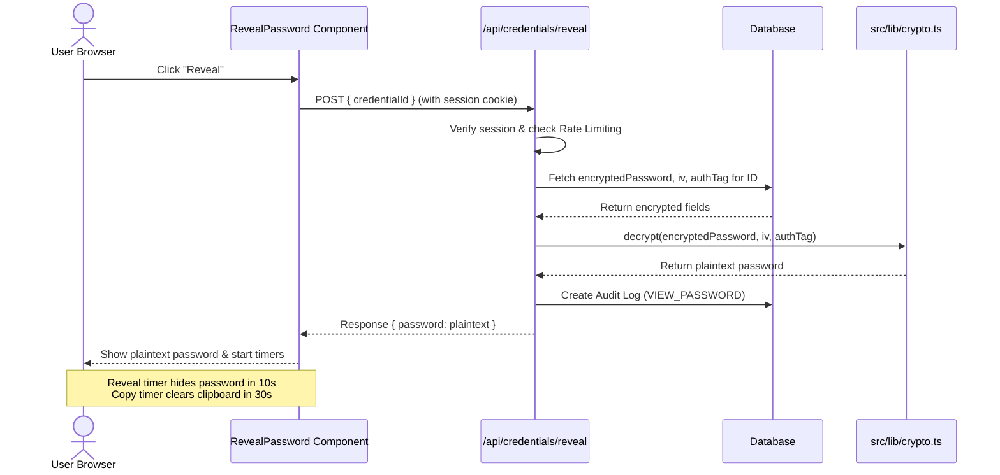

# SecureVault: Security & Architecture Audit Report

This report provides a comprehensive review of the architecture, data flows, and security implementations in **SecureVault**, an enterprise-grade password administration system built with Next.js 16, PostgreSQL 16, and Prisma 7.

---

## 🏗️ 1. System Flow & Architecture

SecureVault is built on a modern, secure, and stateless architecture. The core architecture uses Next.js server-side features (App Router, Server Actions) to ensure that sensitive processing is kept off the client.

### Key Components
*   **Web Layer (Next.js 16):** Serves the UI components, handles routing, and provides API endpoints and Server Actions.
*   **Data Access Layer (Prisma ORM 7):** Handles communication with the PostgreSQL database. All operations are parameterized to prevent SQL injection.
*   **Cryptographic Layer (Node.js crypto & bcrypt):** Performs symmetric encryption/decryption for credentials and slow hashing for user passwords.
*   **Stateless Sessions (jose):** Manages session state via signed JSON Web Tokens (JWT) stored in secure cookies.
*   **Security Audit Logs (Prisma):** Logs administrative activities in an append-only PostgreSQL table.

---

## 🔒 2. Cryptographic Implementations

### A. Encryption & Decryption
*   **Where it happens:** [src/lib/crypto.ts](file:///home/najm/code/administration-system-for-managing-passwords/src/lib/crypto.ts)
*   **Algorithm:** `aes-256-gcm` (Advanced Encryption Standard in Galois/Counter Mode).
*   **Master Key:** Loaded from `process.env.ENCRYPTION_KEY` (32 bytes hex-encoded, 64 characters total).
*   **Initialization Vector (IV):** A cryptographically secure random 12-byte IV is generated for each encryption using `crypto.randomBytes(12)`.
*   **How it works:**
    *   **Encryption:** The `encrypt(plaintext)` function generates the IV, updates the cipher, gathers the 16-byte authentication tag (`authTag`), and returns all three parameters as hex strings. This prevents pattern analysis attacks (identical plaintexts yield unique ciphertexts).
    *   **Decryption:** The `decrypt(ciphertext, iv, authTag)` function initializes the decipher and applies the authentication tag. If the tag fails verification (indicating the ciphertext or metadata was tampered with), the function throws an error, preventing decrypted output from being returned.

### B. Password Hashing
*   **Where it happens:** [src/lib/auth.ts](file:///home/najm/code/administration-system-for-managing-passwords/src/lib/auth.ts)
*   **Algorithm:** `bcrypt` (with a cost factor of `12`).
*   **How it works:**
    *   **Hashing:** The `hashPassword(password)` function delegates to `bcrypt.hash(password, 12)`. This generates a unique salt per password and computes the slow hash to resist brute-force and GPU/ASIC hardware acceleration attacks.
    *   **Verification:** The `verifyPassword(password, hash)` function runs `bcrypt.compare`. bcrypt uses a constant-time comparison algorithm, protecting the password check against side-channel timing analysis timing attacks.

---

## 👥 3. Authentication & Authorization Flows

### A. Authentication Flow
SecureVault manages sessions statelessly using signed JWTs.

*   **Session Token:**
    *   Signed using the HS256 algorithm via the `jose` library.
    *   Cookie name: `session`.
    *   Duration: 24 hours.
    *   **Cookie Flags:**
        *   `httpOnly: true`: Prevents client-side scripts (XSS) from accessing session tokens.
        *   `secure: true` (in production): Forces browsers to send the cookie only over HTTPS connections.
        *   `sameSite: "lax"`: Restricts cookie transmissions on cross-origin requests to defend against CSRF.
        *   `path: "/"`: Restricts session cookie scope to the root path.

### B. Authorization (RBAC) Flow
Access rights are strictly restricted using Role-Based Access Control:
*   **`SUPER_ADMIN`**: Full read/write access to credentials, user profiles, audit logs, and backups.
*   **`EDITOR`**: Read/write access to credentials. Cannot access user management, audit logs, or backups.
*   **`VIEWER`**: Read-only access to credentials metadata and password reveals. Cannot perform write operations.

Role checks are enforced using:
*   `requireRole(allowedRoles: Role[])` in [src/lib/auth.ts](file:///home/najm/code/administration-system-for-managing-passwords/src/lib/auth.ts#L51-L63).
*   `verifySession()` in [src/lib/auth.ts](file:///home/najm/code/administration-system-for-managing-passwords/src/lib/auth.ts#L37-L45).

---

## 🔑 4. Credentials & Vault Flow

### A. Storing a Password
1.  The user inputs the password into `CredentialForm` ([src/components/credential/CredentialForm.tsx](file:///home/najm/code/administration-system-for-managing-passwords/src/components/credential/CredentialForm.tsx)).
2.  Zod validates the input on both client and server side.
3.  The `createCredential` server action ([src/app/actions/credentials.ts](file:///home/najm/code/administration-system-for-managing-passwords/src/app/actions/credentials.ts#L30-L84)) encrypts the plaintext password using `encrypt(password)`.
4.  The encrypted string, IV, and auth tag are saved to the database. A `CREATE_CREDENTIAL` event is appended to the audit logs.

### B. Reading and Revealing a Password
1.  When navigating to `/dashboard/vault` ([src/app/dashboard/vault/page.tsx](file:///home/najm/code/administration-system-for-managing-passwords/src/app/dashboard/vault/page.tsx)), the database query retrieves *only* non-sensitive columns (`id`, `title`, `username`, `url`, `notes`, `category`, `updatedAt`). The ciphertext fields (`encryptedPassword`, `iv`, `authTag`) are omitted.
2.  The user clicks "Reveal" in `RevealPassword` ([src/components/credential/RevealPassword.tsx](file:///home/najm/code/administration-system-for-managing-passwords/src/components/credential/RevealPassword.tsx)).
3.  The client initiates a POST request to `/api/credentials/reveal` ([src/app/api/credentials/reveal/route.ts](file:///home/najm/code/administration-system-for-managing-passwords/src/app/api/credentials/reveal/route.ts)).
4.  The API route verifies the user's session, rate limits requests by user ID, fetches the ciphertext/IV/authTag from the database, decrypts it, logs a `VIEW_PASSWORD` audit entry, and returns the plaintext.

---

## 🛡️ 5. Analysis of Key Security Mitigations

Here is how each of the specific security controls requested is implemented in the codebase:

### 1. Input Sanitization
*   **Implementation:** All inputs are parsed using **Zod schemas** before any database operations. Safe-parsing (`safeParse`) yields structured, validated objects. Leading/trailing whitespaces are trimmed, emails are lowercased, and length limits are strictly enforced. A shared `idSchema` (UUID validation) ensures `deleteCredential`, `deleteUser`, and the reveal endpoint also receive properly formatted identifiers.
*   **Where to find:** Schemas defined in [src/lib/validations.ts](file:///home/najm/code/administration-system-for-managing-passwords/src/lib/validations.ts); applied in all server actions ([auth.ts](file:///home/najm/code/administration-system-for-managing-passwords/src/app/actions/auth.ts), [credentials.ts](file:///home/najm/code/administration-system-for-managing-passwords/src/app/actions/credentials.ts), [users.ts](file:///home/najm/code/administration-system-for-managing-passwords/src/app/actions/users.ts)) and the [reveal API route](file:///home/najm/code/administration-system-for-managing-passwords/src/app/api/credentials/reveal/route.ts).

### 2. CSRF Protection
*   **Implementation:**
    *   All write/update actions are initiated via **Next.js Server Actions** (declared with `"use server"`), which are inherently POST-only.
    *   The `/api/credentials/reveal` custom API route validates the `Origin` (or `Referer` as fallback) header against the server's `Host` header, rejecting cross-origin requests with a `403 Forbidden`.
    *   Authentication cookies utilize `SameSite=Lax`, preventing browsers from transmitting session identifiers on cross-origin form submissions.
*   **Where to find:** Session cookie config in [src/lib/session.ts](file:///home/najm/code/administration-system-for-managing-passwords/src/lib/session.ts#L46-L52); origin validation in the [reveal API route](file:///home/najm/code/administration-system-for-managing-passwords/src/app/api/credentials/reveal/route.ts).

### 3. Content Security Policy (CSP) Headers
*   **Implementation:** Configured inside `nextConfig.headers`. Strict security rules restrict source origins:
    *   `default-src 'self'`: Default fallback to current origin.
    *   `script-src 'self' 'unsafe-eval' 'unsafe-inline'`: Restricts script loading.
    *   `style-src 'self' 'unsafe-inline'`: Restricts style injection.
    *   `img-src 'self' data: blob:`: Configures image loading sources.
    *   `frame-ancestors 'none'`: Prevents clickjacking by denying page iframe loading.
    *   `form-action 'self'`: Directs form submissions only to the same origin.
*   **Where to find:** [next.config.ts](file:///home/najm/code/administration-system-for-managing-passwords/next.config.ts#L12-L22).

### 4. X-Frame-Options & X-Content-Type-Options Headers
*   **Implementation:**
    *   `X-Frame-Options: DENY`: Blocks clickjacking attacks by forbidding the page from being rendered in frames or iframes.
    *   `X-Content-Type-Options: nosniff`: Prevents MIME-type sniffing (browsers executing files that do not match their declared Content-Type).
*   **Where to find:** [next.config.ts](file:///home/najm/code/administration-system-for-managing-passwords/next.config.ts#L24-L31).

### 5. Audit Log Tamper Detection
*   **Implementation:** Audit logs are **append-only** at the application level. There are no functions, Server Actions, or API endpoints exposed in the application for updating or deleting logs.
*   **Where to find:** Log creation helper in [src/lib/audit.ts](file:///home/najm/code/administration-system-for-managing-passwords/src/lib/audit.ts#L28-L53) uses only `db.auditLog.create()`.

### 6. Session Invalidation on Password Change
*   **Implementation:** When a user successfully updates their password via the `changePassword` action, two things happen:
    1. A `sessionVersion` counter on the user record is **incremented** in the database.
    2. The current session cookie is programmatically deleted by calling `deleteSession()`.
    *   On every subsequent request, `getSession()` verifies that the JWT's embedded `sessionVersion` matches the database value. If it doesn't (password was changed on any device), the session is rejected — **all sessions across all devices are invalidated immediately**, not just the current browser.
*   **Where to find:** `sessionVersion` field on [User model](file:///home/najm/code/administration-system-for-managing-passwords/prisma/schema.prisma); version check in [src/lib/session.ts](file:///home/najm/code/administration-system-for-managing-passwords/src/lib/session.ts); version increment in [src/app/actions/users.ts](file:///home/najm/code/administration-system-for-managing-passwords/src/app/actions/users.ts).

### 7. Clipboard Auto-Clear
*   **Implementation:** In the client UI, clicking the copy button copies the decrypted credential to the clipboard. The component sets a 30-second timeout. After 30 seconds, it reads the clipboard, checks if the current contents match the copied password, and, if so, clears the clipboard.
*   **Where to find:** `copyToClipboard` callback in [src/components/credential/RevealPassword.tsx](file:///home/najm/code/administration-system-for-managing-passwords/src/components/credential/RevealPassword.tsx#L62-L72).

### 8. Password Reveal Timeout
*   **Implementation:** When the decrypted password is returned to the client, a 10-second timer begins. After 10 seconds, the component sets `visible` to `false` and clears the plaintext password from state.
*   **Where to find:** `reveal` callback in [src/components/credential/RevealPassword.tsx](file:///home/najm/code/administration-system-for-managing-passwords/src/components/credential/RevealPassword.tsx#L42-L46).

### 9. Rate Limiting on Login
*   **Implementation:** Uses a sliding window rate limiter backed by an in-memory `Map`. It tracks timestamps of requests. If an IP triggers 5 login attempts inside a 15-minute window, subsequent attempts are blocked.
*   **Where to find:** Configured in [src/lib/rate-limit.ts](file:///home/najm/code/administration-system-for-managing-passwords/src/lib/rate-limit.ts#L86-L89) (`LOGIN_RATE_LIMIT`) and checked by IP in [src/app/actions/auth.ts](file:///home/najm/code/administration-system-for-managing-passwords/src/app/actions/auth.ts#L33-L41).

### 10. Parameterized Queries
*   **Implementation:** SecureVault uses the **Prisma ORM** to query PostgreSQL. Prisma converts ORM calls to parameterized SQL queries natively. This abstracts raw SQL execution and neutralizes SQL injection vulnerabilities.
*   **Where to find:** Applied system-wide in all files making calls to the Prisma `db` client (e.g., [src/lib/db.ts](file:///home/najm/code/administration-system-for-managing-passwords/src/lib/db.ts)).

---

## 🔍 6. Security Analysis & Best Practices Review

> [!NOTE]
> **Key Audit Finding: Unregistered Routing Proxy**
> The authentication proxy logic is written inside [src/proxy.ts](file:///home/najm/code/administration-system-for-managing-passwords/src/proxy.ts). In Next.js, middleware must be registered in a file named `middleware.ts` (or `middleware.js`) at the root of the project or inside `src/`. Because the file is named `proxy.ts`, it is currently not being executed by Next.js. 
> To ensure correct route protection and automatic redirects, the file should be renamed to [src/middleware.ts](file:///home/najm/code/administration-system-for-managing-passwords/src/middleware.ts) or imported/called from a `middleware.ts` file.

### Strengths of the Implementation:
1.  **Defense-in-depth on data exposure:** Initial dashboard loads do not retrieve encrypted passwords from the database, preventing memory leaks of ciphertexts into HTML. Ciphertexts are only retrieved and decrypted on demand with rate limiting and logging.
2.  **Robust symmetric cryptography:** Uses `aes-256-gcm`, providing authenticated encryption that ensures integrity verification.
3.  **Auditability:** Every credential view, creation, deletion, or modification is captured by a strict, tamper-evident audit logging system, which logs the IP Address and User-Agent headers.
4.  **Client-side protections:** Clipboard auto-clearing and reveal timeouts reduce the risk of shoulder surfing and exposure of secrets.
5.  **Strict cookie security:** The `SameSite=Lax`, `HttpOnly`, and `Secure` attributes on session cookies provide solid protection against CSRF and token stealing via XSS.
6.  **Server-side session revocation:** A `sessionVersion` counter embedded in JWTs enables instant invalidation of all active sessions when a password is changed, preventing stolen token reuse.
